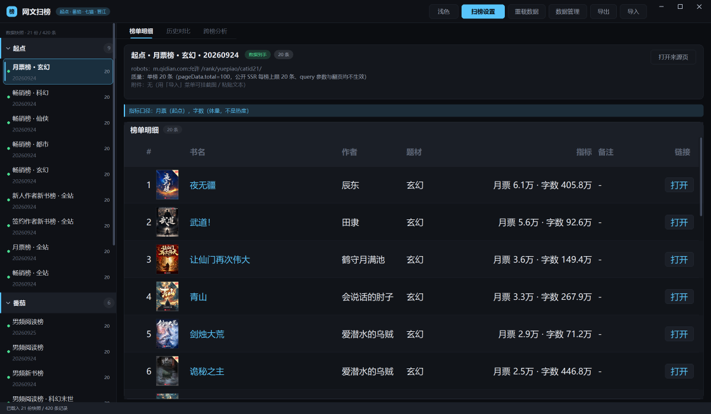
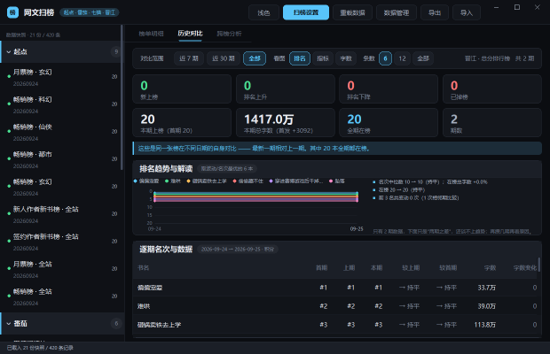
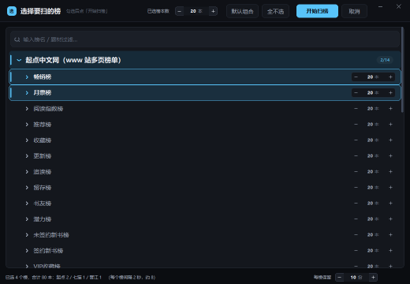
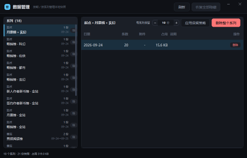
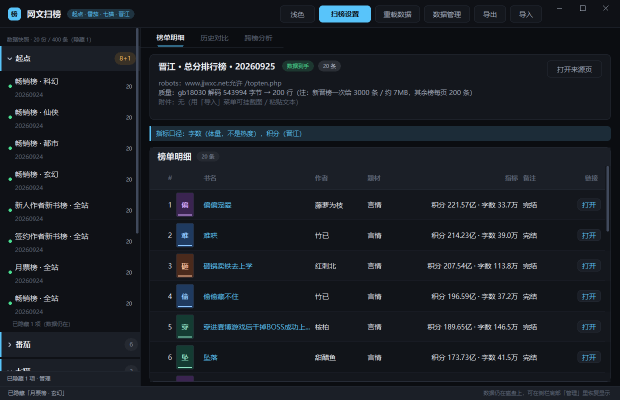
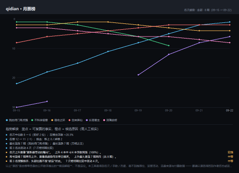
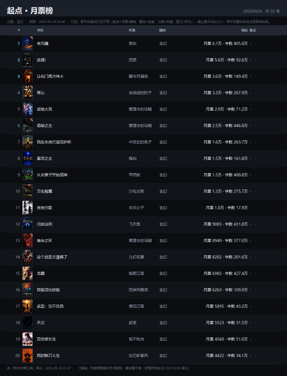
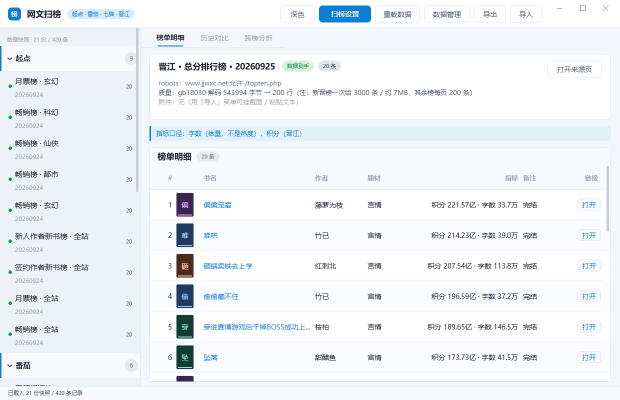
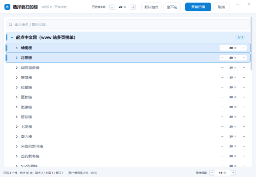

# 网文扫榜工具

<p align="center">
  
</p>

一个**纯 Dart、零第三方依赖**的网文榜单采集与分析工具：只用 `package:ffi` 直调 Win32
（`user32` / `gdi32`）画界面，不引 Flutter、不引 Qt、不引任何第三方包 ——
连 PNG 编解码、GBK 解码、deflate 压缩都是手写的。

覆盖四个平台：**起点 / 番茄 / 七猫 / 晋江**。

核心不是"抓一次排名"，而是**把同一张榜跨天的历史存下来，看它自己的排名与数据怎么变**，
并给出**可复算的趋势解读** —— 哪几条是事实、哪几条只是候选原因，界面上分开标。

## 界面

| 榜单明细（书封面 + 可点开的书链接） | 历史对比（与自己过去各期比） |
|---|---|
|  |  |

| 扫榜设置（折叠树 + 每榜本数） | 数据管理（按期 / 按系列） |
|---|---|
|  |  |

| 侧栏隐藏榜单（数据仍在） | 导出的趋势图（带解读块） |
|---|---|
|  |  |

**导出的榜单长图**（列与界面「榜单明细」一致，含真封面；整榜不分页）：



**深色 / 浅色两套主题**（顶栏一键切换，记在 `out/ui.json`）：

| 榜单明细（浅色） | 扫榜设置（浅色） |
|---|---|
|  |  |

---

# 功能

## 采集

- **四平台适配器**：起点（www 站 SSR + catid 题材榜）、番茄（`category/list` 接口）、
  七猫（Nuxt 内嵌载荷）、晋江（topten 表格 + gb18030）。
- **四道护栏**，每条都有实测依据：
  1. **域名白名单** —— 逐跳校验，重定向也跑不掉；
  2. **robots 判定** —— 按 user-agent **分组**解析（精确组优先），三态如实上报
     （`fetched` / `notFound` / `unknown`），403 或超时**不谎报允许**；
  3. **限速** —— "预约时间槽"实现，判断与写入之间无 `await`，并发下也真的生效；
  4. **仅元数据** —— 结构上禁止携带正文字段。
- **免登录、不绕反爬**：不模拟浏览器、不用 Cookie、不碰验证码；
  遇到挑战页**停手并如实记录**，不做绕过。
- **番茄字体反爬已解开**：那份字体是思源黑体 SC 的子集，把字形栅格化后做最近邻 +
  用字形在 em 框里的绝对位置消歧，得到完整映射；**绑定字体哈希**，哈希对不上就不解码，
  退回 `〔名待补〕`。
- **书封面**（可关的"额外一小步"）。四个平台的取法**不一样**，如实列出来：

  | 平台 | 封面从哪来 | 额外请求 |
  |---|---|---|
  | 起点 | 榜单行里就有；且地址是 `bookId` 的**纯函数**（`/qdbimg/349573/{id}/150`），**直接推导** | **0**（连页面都不用抓） |
  | 番茄 | 榜单接口**不给**封面 → 去书籍页抠 `novel-pic` 那张（225×300） | 每本书 1 次 |
  | 七猫 | 同上 → 去书籍页抠 `readerCover` 那张（195×260） | 每本书 1 次 |
  | 晋江 | 书籍页里**没有**封面 | —— 画占位卡 |

  ★ 起点那条"推导"很重要：**之前采集的旧快照里没有封面字段**，
  靠推导才能让老数据也有封面（不用重扫）。

  ★ 番茄/七猫是"扒书籍页"而不是"抓页面第一张图"：书籍页上有"猜你喜欢"，
  那些封面同样落在图片 CDN 上，**显示错的书封面比不显示更糟**。
  所以只认"只属于本书封面"的路径特征（两家各抓两次验证过稳定）。

  取图一律**懒加载 + 永久缓存**：只有滚动到可见的行才会入队，每本书**一辈子只下一次**
  （按 `bookId` 落盘到 `out/扫榜/_covers/`）。**只认白名单域名**，
  跨域重定向不跟随，单张超过 4 MB 直接放弃。取不到就画占位卡。

## 本地数据库

- `out/扫榜/index.json`：**快照清单 + 保留策略 + 图片附件登记**，采集即入库。
- **加载自愈**：磁盘上有、索引里没有的快照会自动补进来并落盘。
- **保留策略按系列**（同平台 + 同榜 + 同题材）计，不是按榜名 ——
  否则同一张榜的多个题材会互相抢名额。
- **隐藏 ≠ 删除**：被隐藏的榜只是不在侧栏显示，数据、索引、附件一个都不动。

## 分析与解读

- **榜单明细**：`# / 封面 / 书名 / 作者 / 题材 / 指标 / 备注 / 链接`；
  封面是 **36×48 的严格 3:4 缩略图**（按别的比例缩放会把书封拉变形）；
  **书名与「打开」按钮都能点**，直接打开这本书的详情页；没有封面地址的书画占位卡
  （首字 + 由书名哈希决定的稳定配色），所以每一行的封面格宽度始终一致。
- **历史对比**：同一张榜**自己的历史**按时序排开 —— **每本书各自一条折线**
  + 逐期名次与数据表（首期 / 上期 / 本期 / 较上期 / 较首期 / 字数 / 字数变化）。
  折线可以换**看图口径**：`排名`（y 轴反向，越小越靠上）/ `指标`（月票、热度、积分…）/
  `字数`；还能选画 `6 / 12 / 全部` 条。两种口径的选线规则不同 ——
  排名看"名次最好 + 波动最大"，指标/字数看"**变化最大**"（涨得最猛、跌得最狠的才值得看）。
  某期掉榜就**真的断开**，不连到轴上（连上去等于画出一条不存在的轨迹）。
  绝不回到"用户手挑两份文件"那套语义。
- **趋势解读**：每条原因都由**规则**从可复算的数字触发，带三样东西 ——
  **证据**（用了哪几个数）、**置信度**（较强 / 中等 / 较弱）、**边界**（本工具看不到什么）。
  界面上**事实（蓝点）与候选原因（橙点）视觉分开**，卡片底部常驻"需人工核实"。
  **期数 < 3 就不猜**，只说"这只是两期之差"。
- **跨榜分析**：一张**各平台主流题材对比表** —— 行是平台，列是
  `题材数 / 条数 / 集中度（前三题材占比，带条）/ 主流题材前 3（带各自占比）`。
  点行即可切换下面那张"该平台的完整题材分布"（条形 + 占比 + 该题材最好名次）。
  另外还有"同时出现在多个榜的书"（跨榜信号，可滚动）。
  **各平台的分类体系不同，名字对不齐**（起点 玄幻/仙侠/都市，番茄 都市高武/架空历史，
  晋江整站只有"言情"）—— 所以对比的是**集中度**，不是"谁的玄幻更多"。
  只有一个题材的平台会标注"（该平台未细分题材）"，免得 100% 被读成"极度集中"。

## 界面

- **深色 / 浅色两套主题**，顶栏一键切换，偏好写在 `out/ui.json`。
  浅色档不是把深色反过来：底色带蓝（纯白会让卡片"浮不起来"）、主色更深
  （白底对比度 4.6:1）、投影只能用淡灰蓝（深黑会成一圈脏边）。
- **侧栏按平台折叠**（宽 280、行高 62、榜名 15px）；悬停某行右侧浮出"⊘"把整张榜
  **隐藏**，底部「已隐藏 N 项 · 管理」可恢复。
- **扫榜设置**：折叠树（平台 → 榜 → 题材，可搜索过滤，**没有子节点的行不画折叠箭头**）+
  三态选中（整行蓝框：全选 = 选中底 + 主色描边 + 左侧竖条，部分选中 = 主色淡底）+
  **每个榜有自己的本数**（`− N 本 +`，点数字可直接输入任意值），
  顶栏另有"所有已选榜统一改"的批量步进器。
- **数据管理窗**：左栏系列（平台 · 榜 · 题材 + 份数 + 日期区间），
  右栏该系列的每一期（日期 / 条数 / 附件 / 占用，每行可删），
  顶部"每系列保留 N 份"；**破坏性动作先报数再执行**。
- **字号与行高随窗口缩放**：基准 1240×800，上限 **1.4×**。缩放曲线带权重（0.52）
  与 2% 量化 —— 窗口拉大一截才跳一小档，不会"突然大一圈"，拖动时也不抖。
- **「榜单明细」整表放大 1.5 倍**（列宽 / 字号 / 行高 / 封面**同乘一个数**，
  版面比例不变），而且是**自适应**的：
  **窗口够宽就用到满 1.5 倍**（行高 126、字号 29、封面 76×101）；
  **窗口不够就等比缩到刚好放得下**（下限 1.0 倍）——
  宁可小一号也不让「链接」列被挤出屏幕（看不到按钮就等于点不开）。
  放得下时表格还会**撑满可用宽**（右侧不留空缺，余量给「书名」列）。
  只有在缩到下限 1.0 还放不下的极窄窗里才横向滚动
  （点滚动条两侧翻页 / 滚轮停在滚动条上 / 触摸板双指横扫 / 倾斜滚轮）。
- **每本书**：整行都可点（不用去点那个小按钮），悬停整行高亮、书名加下划线，
  点开的是系统默认浏览器里的书籍详情页。**打不开时如实说**并把地址放进剪贴板。
- **备注列只放短字段**（榜变 / 连载·完结 / 状态），**不塞小说简介** ——
  几百字的多行简介塞进一格会把整列挤成 `任…`，真正有用的信息反而看不清。

## 导入导出

导出菜单**按用途分两块**（这两类产物口径完全不同，混在一起用户分不清
"我导出的到底是这一份榜，还是这个榜的历史"）：

**① 榜单（这一份快照）**

| 导出 | 说明 |
|---|---|
| CSV 明细表 | 带 BOM（防 Excel 中文乱码），公式注入已消毒 |
| JSON（单份快照 + 分析） | 这一份的条目 + 分析结果 |
| 榜单图片（PNG 长图） | 整榜长图，不受窗口可视区限制；**列与界面的「榜单明细」完全一致** |
| 附件（图片 / 文本） | 把当前快照的附件复制到导出目录 |

> 榜单图的列 = `# / 封面 / 书名 / 作者 / 题材 / 指标 / 备注`，
> 表头文字、单元格文本、列宽基准、对齐方式、谁吃余量**全部只有一份定义**
> （`lib/ui/board_text.dart`），界面与导出图共用 —— 改了界面导出图一定跟着变。
> 唯一的例外是「链接」：它在界面里是个**可点按钮**，静态图里画个"打开"没有意义，
> 所以导出图不画它（图脚会说明"详情页地址见 CSV/JSON 导出"）。
> 导出前会**先把封面备齐**（走同一个限速 + 落盘缓存），所以图里是真封面而不是占位卡。

> **导出完成后会弹一个明确的提示框**（写明导出了什么、存到哪、多大）。
> 之所以要有它：导出后会顺手打开导出目录，**那个窗口会抢走注意力**，
> 只看状态栏等于没提示。

**② 趋势分析 / 历史对比（跨期产物）**

| 导出 | 说明 |
|---|---|
| 趋势图（PNG，含解读） | 折线 + **趋势解读块** |
| 全部快照汇总（含两两对比） | 概览 + 各系列的两两对比 |

导入：**图片**存为该快照的附件（文件选择框）、**粘贴文本**存为附件文本（读剪贴板）。
附件挂在**稳定 id** 上（`{source}|{board}|{cat}|{日期}`），重启后仍能找回；
重名自动加 `_2` / `_3` 后缀，绝不覆盖。

---

# 使用

## 从源码跑起来

只需要 **Dart SDK ≥ 3.0**（没有任何第三方依赖）：

```bash
dart pub get

# 桌面软件（Windows）
dart run bin/main.dart out

# 命令行：先看有哪些榜（本地枚举，不联网），再抓一轮
dart run bin/scan.dart boards
dart run bin/scan.dart sweep --selftest-trend   # 16 次请求，约 35 秒

# 生成单文件网页并打开
dart run bin/page.dart --open
```

> 数据目录 `out/` 是**外置**的（与工作目录同级，不在仓库里）：跑一次采集就自动建好
> —— 快照 + `index.json` 索引 + 报告 + 附件。重打包 exe 不会覆盖它。

## 命令行

| 命令 | 作用 |
|---|---|
| `dart run bin/scan.dart boards` | 本地枚举平台 / 榜 / 题材，**不联网** |
| `dart run bin/scan.dart scan --source qidian --board 月票榜 --category 玄幻` | 抓单个榜 |
| `dart run bin/scan.dart sweep --selftest-trend` | 一轮周扫（16 次请求，约 35 秒） |
| `dart run bin/page.dart [--open]` | 生成自包含的单文件网页 |
| `dart run bin/main.dart [数据目录]` | 起 GUI（默认数据目录 `out`） |

退出码沿用 oh-story 的红线约定：`0` 全成 / `1` 零产物 / `2` 部分产物。

## 桌面软件：单 exe，双击就开

```cmd
build_exe.cmd
```

产出 `build\网文扫榜工具.exe`（约 8.1 MB，单文件、GUI 子系统、不弹黑框）。

**为什么不用 `dart compile exe`**：某些沙箱环境里 `dart.exe` spawn 子进程时管道句柄会被耗尽，
一律报 `CreateFile failed 231 (所有的管道范例都在使用中)` + `process_win.cc:744`，
且**与路径是否为中文无关**。所以 `build_exe.cmd` 走等价的三步手工链路：

| 步骤 | 命令 | 作用 |
|---|---|---|
| 1 | `dartaotruntime gen_kernel_aot.dart.snapshot … --target-os=windows --aot` | Dart → `program.dill` |
| 2 | `gen_snapshot.exe --snapshot-kind=app-aot-elf --elf=snapshot.aot program.dill` | dill → 机器码 ELF |
| 3 | `tool/wrap_pe.dart` | 把 ELF 作为 `snapshot` 节追加进 `dartaotruntime.exe` |

第 3 步是手工复刻 `pkg/dart2native/lib/dart2native_pe.dart`（逐行对照实现），
顺手把可选头的 Subsystem 从 `CONSOLE(3)` 改成 `WINDOWS_GUI(2)` ——
否则双击 exe 会**额外弹一个黑色控制台框**。

打包链的最后一步是 **嵌图标**（`[5/5] 嵌图标`）：`tool/embed_icon.ps1` 直接调 Win32 资源 API
（`BeginUpdateResource` → `UpdateResource` → `EndUpdateResource`）把 `assets/icon/app.ico`
写进 exe（`RT_ICON` + `RT_GROUP_ICON`），资源管理器 / 任务栏 / 快捷方式上显示的就是它；
**不依赖 SDK 或 rcedit**，也**不删原有资源**（manifest、版本信息原样保留）。
没有 ico 就跳过，嵌失败只警告不打断打包。图标怎么来的见 [`assets/icon/README.md`](assets/icon/README.md)。

> 两个坑：① `gen_snapshot.exe` **不能加 `--aot`**（会报 `Unrecognized flags: aot`）。
> ② `build_exe.cmd` 里的中文注释必须存成 **GBK** —— cmd 按当前代码页读脚本，
> 存 UTF-8 会让注释里的括号**截断 `if` 语句块**，报一堆"不是内部或外部命令"。
> ③ 覆盖 exe 时若报 `Cannot open file ... errno = 32`（被 Defender/索引器持有读句柄），
> **先写到临时名再改名覆盖**即可 —— 改名替换不受读句柄阻挡。

## 网页：单文件，双击就开

`开始.cmd` 选 `3`（先抓一轮，再生成网页并用默认浏览器打开）。
生成物是一个自包含文件 `榜单页.html`（数据全部内嵌，约 1 MB）：
不用联网、不用起服务、拷到别的电脑也能直接看。

页面里有：概览（各平台快照数 / 按平台分列的题材分布 / 跨榜信号）、
单榜详情（质量摘要、robots 判定、来源链接、**指标口径声明**、题材分布、热词、榜单明细）、
以及"对比基准"差分。

## 自检与回归

`bin/` 下有一批 `_t_*.dart` / `_test_*.dart` / `_smoke_gui*.dart`，每个都是**独立可跑**的
自检脚本，共 42 个、1000+ 条断言，覆盖数据层 / 分析层 / 渲染层 / 命中测试 / 裁剪 /
导出安全 / 主题切换：

```bash
bash tool/run_all_tests.sh              # 一把跑完全部（每个脚本一个独立进程）

dart run bin/_smoke_gui_full.dart     # GUI 全链路：主窗与设置窗实例化 + 离屏绘制 + 点击校验
dart run bin/_t_ui_settings.dart      # 主题 / 设置持久化 / 侧栏折叠与隐藏 / 设置窗树 / 窗口按钮图标
dart run bin/_t_scan_dialog.dart      # 扫榜设置窗：本数任意输入 / 每榜独立 / 折叠符号
dart run bin/_t_cover_link.dart       # 明细表：封面比例 / 自适应缩放 / 撑满宽 / 整行可点 / 备注无简介
dart run bin/_t_book_link_real.dart   # ★ 真窗口 + 真消息：点「打开」真的走到 ShellExecuteW
dart run bin/_t_chart.dart            # 折线图：名次轴反向 / 指标轴正向 / 断点 / 选线规则
dart run bin/_t_cross_profile.dart    # 跨平台题材画像：Top1/Top3 口径 / 未细分题材标注
dart run bin/_t_timeseries.dart       # 时间序列：跨期对比 / 轨迹补全 / 变化分组
dart run bin/_t_insight.dart          # 趋势解读：事实 / 候选原因 / 边界纪律
dart run bin/_t_index_sync.dart       # 索引：采集即入库 / 自愈 / 保留策略跨会话
dart run bin/_t_png_decode.dart       # PNG 编解码：往返 / 真 deflate / 压缩率 / 极端尺寸
dart run bin/_t_store_v2.dart         # 快照存储：保留策略 / 附件 / 向后兼容
```

> 为什么"能不能编译"靠**真跑一遍**来验证：部分沙箱里 `dart analyze` / `dart compile`
> 会因为管道句柄耗尽直接失败。所以这些脚本本身就是编译验证 ——
> 它们会把窗口类真的实例化、把绘制跑到真实的 GDI 内存 DC 上。

> 同一类沙箱里 `dart run` 起的**子进程**也起不来（`CreateFile failed 231`），
> 所以"必须启动浏览器"的真实网络用例（`_t_qidian_e2e.dart`）在那里必然走不通 ——
> 跑批脚本会把这种情形标成 `ENV`，与真正的失败分开。

`dart run bin/_render_shots.dart <数据目录>` 把界面**离屏渲染**成 PNG（`build/shots/`），
不依赖截屏权限；`dart run tool/pick_shots.dart` 把值得入库的几张挑进 `docs/screenshots/`。

四个**诊断探针**（不是断言，是"把账摊开给你看"）：

- `dart run bin/_probe_detail_layout.dart <数据目录> [--size=WxH] [--shot=out.png]`
  —— 明细表的**版面账**：列宽、两种偏移下每列的可见区间、溢出多少、
  右侧有没有空缺、以及**量像素量出来的真实行高**（按行分隔线的间距量）。
- `dart run bin/_probe_metric_chart.dart <数据目录>`
  —— 把「历史对比」的三种看图口径（排名 / 指标 / 字数）各渲染一张，核对 y 轴方向与刻度。
- `dart run bin/_probe_export_real.dart <数据目录> [平台]`
  —— 用**真实数据**导出一张榜单图（走导出同一条路径），核对"图与界面是否一致"。
- `dart run bin/_probe_book_link_click.dart <数据目录>`
  —— 点「打开」没反应时，把三段链路拆开验：
  ① 命中区登记（绘制侧）② onClick（事件侧）③ `ShellExecuteW` 绑定（系统侧）。

发布版 exe 自己也能自检（GUI 子系统没有 stdout，结果写文件）：

```bash
网文扫榜工具.exe --selftest-shot=shot.png          # 真窗口渲染 → 截图 + 颜色数
网文扫榜工具.exe --selftest-click-link=log.txt     # 真窗口里真投递一次左键，验「打开」
```

---

# 设计取舍

几条**刻意**的做法，都带着"为什么"：

- **不装成能用**：样本不足就报 sparse；书名被字体混淆就标 `〔名待补〕` 且**不算热词**
  （拿乱码算词频会得到根本不存在的规律）；robots 判定与质量摘要一律如实带出，不报喜藏忧。
- **数字必须可复算，原因必须标明是推断**：趋势解读里事实与候选原因视觉分开，
  每条带证据 + 置信度 + 边界；期数 < 3 就不猜。
- **破坏性动作要报数**：保留策略删了几份、导出少了几行，都要在状态栏 / 图里写出来；
  确认框写清"删几期、释放多少"，且**默认按钮落在"否"**。
- **涨跌语义**：绿 = 表现变好（新上榜 / 排名上升），红 = 表现变差（掉榜 / 下降）——
  与 A 股涨跌色相反，因为它衡量的是"表现好坏"而不是价格。
- **零依赖**：PNG 编解码（含真 deflate）、GBK 解码、GB18030 表、JSON 之外的解析全部手写，
  只为"拷过去就能跑"。
- **数据目录外置**：exe 只是壳，数据在磁盘上；重打包不会覆盖用户数据。

# 已知限制（不装成能用）

- 起点公开 SSR 每榜只有 20 条，**所有 query 参数与翻页都不生效**（17 组实测）；
  再要更多只能走 ajax，而 `/majax/*` 被 robots 禁 → 按 20 条设计。
- 番茄 `rank_version` 是时间戳，**有效期与轮换规律未验证**；每次运行先从 `/rank` 页取一次。
- 番茄字体解码表**绑定字体哈希**；哈希对不上就不解码，退回 `〔名待补〕`。
- 起点首订 / 均订 / 追读属付费侧，公开榜页没有 → "能不能赚钱"这类判断本工具给不出。
- **真正的跨日趋势要连续几天各抓一次**才有；`--selftest-trend` 只是用两个不同榜验证渲染。
- **「榜单明细」的放大倍数随窗口变**：窗口够宽（约 2300px 以上，比如 2560 宽的屏
  最大化）就是完整的 **1.5 倍**；窗口变窄时**等比缩小**到刚好放得下（下限 1.0 倍）——
  宁可小一号也不让「链接」列被挤出屏幕。所以"8 列全可见"是**常态**，
  只有缩到 1.0 倍还放不下的极窄窗（约 1000px 以下）才需要横向滚动。
  这是"看得全"与"放得大"之间的取舍，选了前者。
- 刺猬猫、短剧 / 红果、知乎盐选未做。
- 合规边界如实保留、**没有消除**：起点 robots 点名拒绝 `ClaudeBot` / `ChatGPT-User` / `GPTbot`，
  本工具用 Chrome UA 落在 `User-Agent: *` 组（`/rank/` 允许）—— 这一条由使用者自行判断。

# 第三方素材与合规说明

这个仓库里**唯一**属于第三方的文件是 `test/fixtures/` 下的 6 个样本：

| 文件 | 是什么 | 为什么在仓库里 |
|---|---|---|
| `qidian_yuepiao_page{1,2,3}.html` | 起点月票榜某一天的页面快照 | 让解析相关的回归测试**离线可跑**（不联网、不受对方改版影响） |
| `qidian_font_*.ttf` | 起点榜单页用的那份子集字体 | 同上：字体反混淆表要拿它做真值校验 |

它们**只用于测试**，版权属于原网站，不代表本项目对其有任何权利主张 ——
**也不在下面那条 MIT 许可的覆盖范围内**。如果你是其权利人或代理人，
认为这些样本不应出现在这里，提个 issue 我立刻删掉 ——
删掉之后相关测试会跳过（不会让整个仓库跑不起来）。

### 书封面：这是唯一一处**主动下载第三方图片**的地方

封面是**图片资源**，不在榜单页里（起点除外），所以它必然是一次"额外的出站请求"。
这里的做法与"四道护栏"同一套纪律，但**单独收口**在 `lib/cover_store.dart` 里：

| 约束 | 做法 |
|---|---|
| 只去该去的地方 | 域名**白名单**（`coverHosts` 封面 CDN + `coverPageHosts` 书籍页），其余一律拒绝 |
| 只认本书封面 | 番茄/七猫只抠"只属于本书封面"的路径特征；页面里的作者头像、推荐位、logo 一律不认 |
| 不放大请求量 | **懒加载**：只取"滚动到可见的行"；每本书按 `bookId` **永久缓存**，二次打开零请求 |
| 限速 | 两次下载之间至少隔 120 ms；单张超过 4 MB 直接放弃 |
| 不跟丢白名单 | 跨域重定向**不跟随** |
| 失败就认输 | 取不到 / 解不开 → 画占位卡；绝不用别的书的封面顶上 |

`out/扫榜/_covers/` 就是这些图的落盘缓存（同样**不入库**）。
不想要这个功能的话，把 `lib/cover_store.dart` 里的 `coverHosts` 清空即可 ——
封面会全部退回占位卡，其余功能不受影响。

采集侧的四道护栏在 `lib/guard.dart` 里，每条都带着实测依据；
`out/` 目录（真正采集出来的数据）**不入库**，`.gitignore` 已排除。

# 目录

> ★ = 核心文件；标「跑出来的」的都不在仓库里（`.gitignore` 已排除）。

```
扫榜demo/
  LICENSE                 MIT
  pubspec.yaml            零依赖
  开始.cmd                双击入口（1 抓 / 2 生成网页 / 3 都要）
  build_exe.cmd           手工 AOT 三步链打包单 exe（GBK 编码，别存成 UTF-8）
  榜单页.html             （跑出来的）生成物：单文件网页，双击看
  bin/scan.dart           CLI：boards / scan / sweep
  bin/main.dart           GUI 入口（--selftest-shot 自检截图）
  bin/page.dart           生成单文件网页
  lib/models.dart         数据契约
  lib/guard.dart          四道护栏 + 传输 + EmbeddedJson（三种内嵌载荷解法）
  lib/sources.dart        起点 / 番茄 / 七猫 / 晋江
  lib/fanqie_font.dart    番茄字体反爬解码表（字体哈希门闩）
  lib/qidian_font.dart    起点字体混淆解码表
  lib/store.dart          快照存储（同日覆盖、原子替换、坏文件隔离 + 保留策略）
  lib/snapshot_index_file.dart ★ 本地数据库：out/扫榜/index.json（清单 + 保留设置 + 附件 + 自愈）
  lib/timeseries.dart     ★ 时间序列：同一系列跨期自身对比
  lib/trend_insight.dart  ★ 趋势解读：规则触发的事实 + 候选原因（证据 / 置信度 / 边界）
  lib/analysis.dart       确定性统计 + Markdown 报告
  lib/report_data.dart    ★ 页面数据装配（唯一口径实现）
  lib/png.dart            ★ PNG 编码 + 解码（零依赖手写，含真 deflate）
  lib/cover_image.dart    ★ 封面解码：借系统 WIC（经典 COM，能解 JPEG/WebP）
  lib/cover_store.dart    ★ 封面仓库：推导 / 扒书页 + 白名单 + 限速 + 落盘缓存 + 懒加载
  lib/gbk.dart(+table)    GBK / GB18030 解码器
  lib/ui/theme.dart       ★ 两套色板（深/浅）+ 可缩放度量
  lib/ui/board_text.dart  ★ 「榜单明细」的列定义 + 单元格文本（界面与导出图**共用**）
  lib/ui/widgets.dart     ★ 自绘控件库（tabs / table / badge / card / hint / button / stepper / 滚动条）
  lib/ui/chart.dart       ★ 排名趋势折线（多线 + 悬停读数 + 图例）
  lib/ui/image_export.dart ★ 离屏渲染：榜单长图 / 趋势图（可带解读块）
  lib/ui/main_window.dart ★ 主窗（顶栏 + 侧栏 + 三标签页 + 状态栏 + 导入导出菜单）
  lib/ui/dialogs.dart     ★ 扫榜设置窗（折叠树 + 每榜本数 + 搜索）
  lib/ui/data_manager.dart ★ 数据管理窗（按期 / 按系列管快照 + 隐藏管理）
  lib/ui/settings.dart    界面偏好持久化 out/ui.json（主题 / 折叠 / 隐藏了哪些榜）
  lib/ui/app.dart         窗口与消息循环（无边框自绘标题栏 / 分片消息循环）
  tool/run_all_tests.sh   一把跑完全部自检脚本（每个脚本一个独立进程）
  tool/wrap_pe.dart       把 AOT 快照包成单 exe
  tool/pick_shots.dart    把 build/shots 里值得入库的截图挑进 docs/screenshots/
  tool/make_icon.py       图标生成器：跑一次重出 assets/icon/ 全套 png + ico
  tool/embed_icon.ps1     往 exe 资源里塞图标（纯 Win32，不依赖 SDK）
  assets/icon/            ★ 程序图标：app.ico（16~256 七档）+ 各尺寸 png + 设计说明
  docs/screenshots/       ★ 入库的界面截图（README 用的就是它们）
  test/fixtures/          离线测试夹具（第三方样本，见上）
  out/                    （跑出来的）快照与报告
  build/                  （跑出来的）单 exe、离屏截图、临时测试目录
```

# 许可证

本项目采用 **MIT License**（见 [LICENSE](LICENSE)）：

- 可以自由使用、修改、分发、商用，保留版权声明即可；
- **不提供任何担保** —— 尤其是采集行为本身：请自行确认你对目标站点的抓取
  符合当地法律与对方的使用条款。仓库里的四道护栏（白名单 / robots 判定 /
  限速 / 仅元数据）是"尽量体面"的实现，不是法律意见。

> `test/fixtures/` 下的 6 个样本**不在这条许可范围内**，
> 它们的权利属于原网站，只作为离线测试夹具出现在这里。
