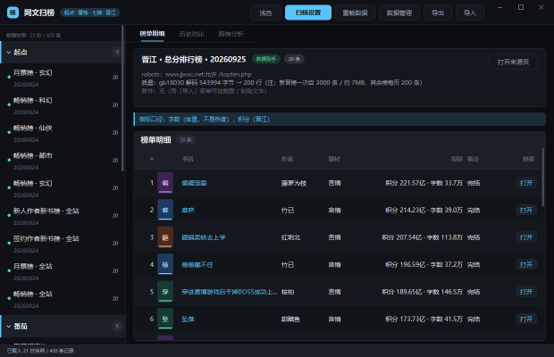
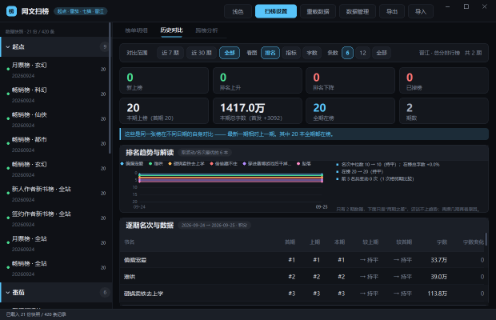
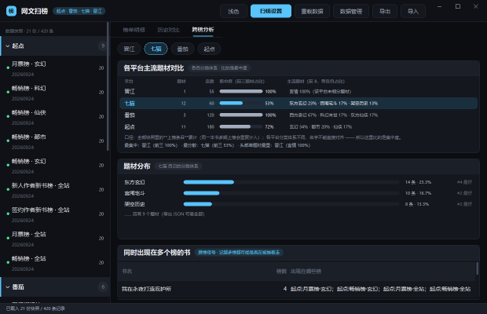
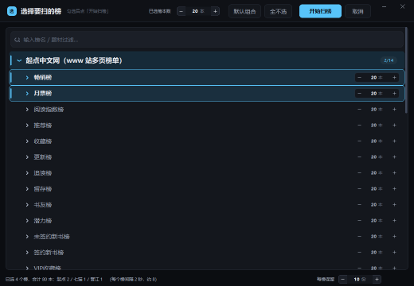
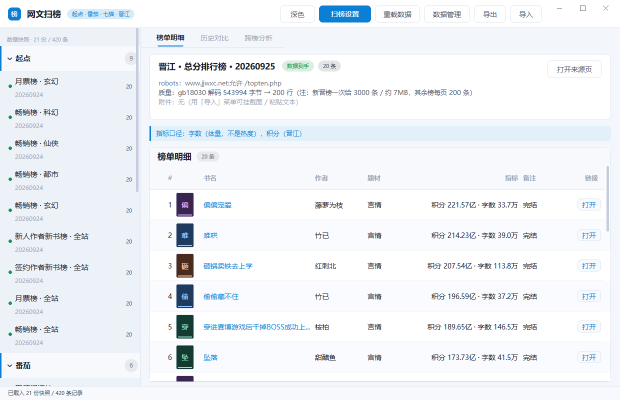

# 网文扫榜工具

<p align="center">
  
</p>

一个**纯 Dart、零第三方依赖**的网文榜单采集与分析工具。覆盖 **起点 / 番茄 / 七猫 / 晋江**
四个平台，界面用 `dart:ffi` 直调 Win32 自绘（不引 Flutter、不引 Qt、不引任何第三方包 ——
连 PNG 编解码、GBK 解码、deflate 压缩都是手写的）。

核心不是"抓一次排名"，而是**把同一张榜跨天的历史存下来**，看它自己的排名与数据怎么变，
并给出**可复算的趋势解读** —— 哪几条是事实、哪几条只是候选原因，界面上分开标。

---

## 下载

**不需要装任何运行环境**，下载后双击就能用：

| 下载 | 说明 |
|---|---|
| **[网文扫榜工具 v1.0（Windows x64）](https://github.com/hxm433/webnovel-rank-scanner/raw/main/release/webnovel-rank-scanner-v1.0.zip)** | 解压后双击 `网文扫榜工具.exe` |

> 只有 Windows 版（界面是 Win32 自绘的）。单文件 exe，约 8.6 MB。
> 数据全部存在 exe 同级的 `out/` 目录里，**不写注册表、不联网上报**。

### 第一次打开

1. 解压到**任意可写目录**（比如 `D:\扫榜工具\`）；
2. 双击 `网文扫榜工具.exe`；
3. 点右上角「**扫榜设置**」→ 勾几个榜 → 点「开始扫」。
   第一次大约 **35 秒**（16 次请求，每次间隔 1.5 秒 —— 对站点友好）。

抓完就能在左侧看到榜单：点书名看详情，点「趋势」看它跨期怎么变。

---

## 界面

| 榜单明细 | 趋势对比 |
|---|---|
|  |  |

| 跨榜对比 | 扫榜设置 |
|---|---|
|  |  |

还有浅色主题（右上角切换）：



---

## 功能

### 采集
- **四个平台**：起点（www 站多页，25 页 × 20 = 最多 500 本）、番茄、七猫、晋江（gb18030 解码）。
- **反爬处理**：起点有字体反爬，工具会**就地破解**它拿回真实书名与数字；
  番茄的字体混淆也会还原并标注「名待补」。
- **合规**：只走公开榜单页、带 `robots.txt` 检查、有全局限速（默认 1.5 秒/请求）、
  域名白名单（越界直接拒绝）。

### 分析
- **跨期趋势**：同一张榜的多份快照对比，看某本书的排名与指标怎么变。
- **可复算的解读**：结论分「事实」与「候选原因」两档，界面上分开标 ——
  数字怎么算出来的可复现，不给你一个没法验证的结论。
- **跨榜对比**：同一本书在不同榜 / 不同平台的表现。

### 导入导出
| 格式 | 说明 |
|---|---|
| **Excel（.xlsx）** | Excel 原生格式，三张表：榜单明细 / 指标口径 / 榜单信息 |
| CSV | 带 BOM（防 Excel 中文乱码），公式注入已消毒 |
| JSON | 单份快照 + 分析结果 |
| 榜单长图（PNG） | 带封面的榜单图，适合直接发给别人 |
| 趋势图（PNG） | 折线 + 解读块 |
| 单文件网页 | 数据全内嵌，双击就开，不联网、不需要服务器 |

**导出位置两种模式**（菜单里切换）：
- 默认：点菜单**直接出文件**（落到 `out/导出`，或你在「设置导出位置…」里设的目录）；
- 打开「每次导出前先问文件夹」后：每次导出先弹文件夹框（**取消 = 本次不导出**）。

---

## 命令行

不想开界面也能用：

```bash
# 看有哪些榜（本地枚举，不联网）
dart run bin/scan.dart boards

# 抓一轮（四个平台各抓几榜）
dart run bin/scan.dart sweep --limit 20 --ms 1500

# 生成单文件网页并打开
dart run bin/page.dart --open
```

---

## 常见问题

**Q：点「打开」跳不到浏览器？**
工具会把地址交给系统默认浏览器。三种情况可能让你觉得"没反应"：
1. **浏览器有多个窗口** —— 新页面可能开在**另一个窗口/后台标签**里，
   先看看任务栏有没有浏览器图标在闪；
2. **浏览器以管理员身份运行** —— Windows 的完整性级别隔离（UIPI）不允许普通程序
   把网址交给管理员程序，浏览器会弹「现有实例正在以提升的权限运行，是否用普通权限重启？」
   → 在那个框里点「**是**」，或**右键本工具 → 以管理员身份运行**；
3. 地址**每次都会自动复制到剪贴板**，直接粘贴到地址栏也行。

**Q：抓不到数据 / 条数很少？**
起点只有装了 Edge / WebView2 才能走 www 站多页（最多 500 本）；
没有浏览器内核时会降级到移动站，**每榜 20 条**，界面会明确标出「【降级】」。

**Q：数据存在哪？能换电脑吗？**
全部在 exe 同级的 `out/` 目录里（快照 JSON + 报告 + 导出文件 + 本地索引）。
整个 `out/` 拷走就能换电脑继续用。

**Q：会不会很占资源？**
单 exe 约 8.6 MB，界面是自绘的，没有浏览器内核。采集时限速 1.5 秒/请求。

---

## 从源码跑

需要 **Dart SDK 3.x**（无需 Flutter）：

```bash
dart pub get
dart run bin/main.dart          # 打开桌面界面
bash tool/run_all_tests.sh      # 跑全量自检（47 个 Dart 脚本 + 2 项外部校验）
```

打包成单 exe：

```bash
cmd /c build_exe.cmd            # 三步：gen_kernel_aot → gen_snapshot → 嵌 PE
```

---

## 文档

| 文档 | 内容 |
|---|---|
| [使用说明](docs/使用说明.md) | 逐步操作：扫榜 / 看榜 / 对比 / 导出 / 网页 / 命令行 |
| [开发说明](docs/开发说明.md) | 完整技术文档：架构、数据格式、设计取舍、已知限制、自检清单 |

---

## 合规说明

- 只采集**公开榜单页**，遵守 `robots.txt`，全局限速，域名白名单；
- 不绕过登录、不采集非公开内容；
- **书封面是唯一一处主动下载第三方图片**的地方，仅用于本地展示，不重新分发；
- 采集到的榜单数据版权归各平台所有，请勿用于商业用途。

## 许可证

见 [LICENSE](LICENSE)。
